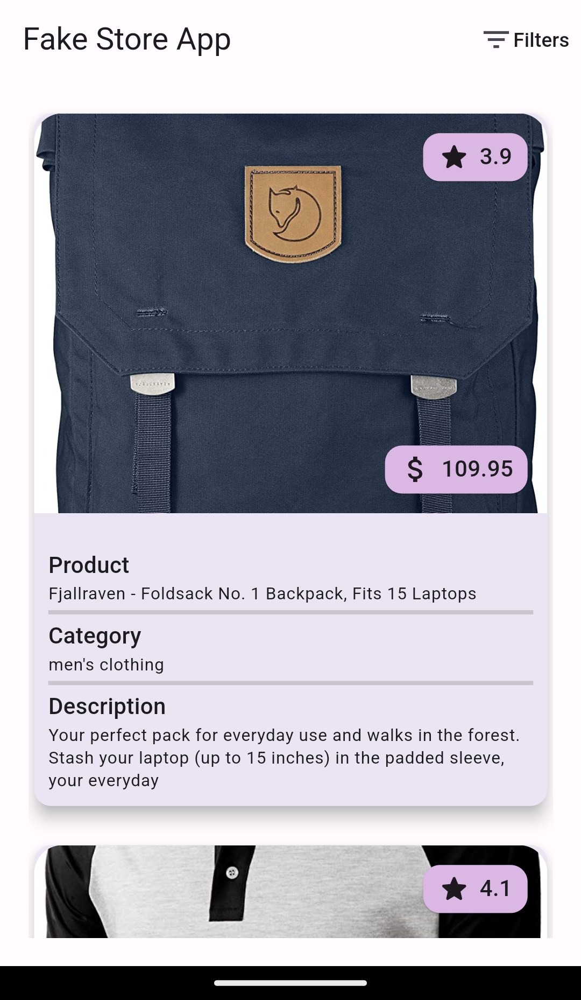
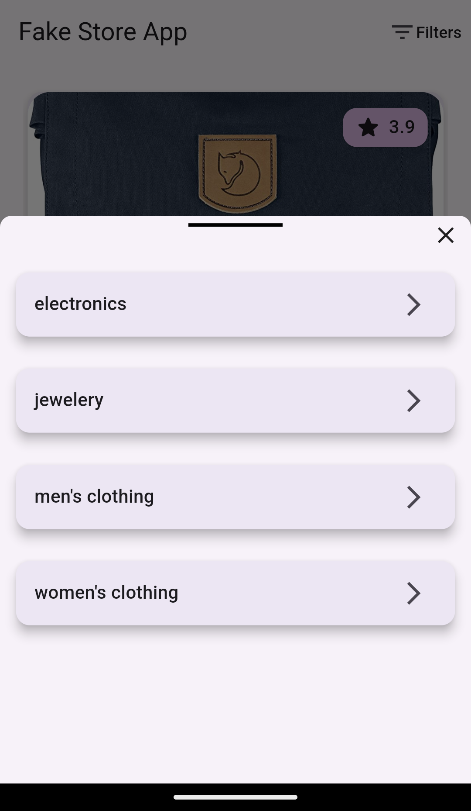

# Fake-Store-Bloc
<b>Simple Fake Store Bloc App</b> 
-Used Fake Store API. 
-Used Cubit(bloc) State Management. 
-It's a simple project to study Cubit(bloc) State Management. 
-These are some of the screenshots of my project. 

